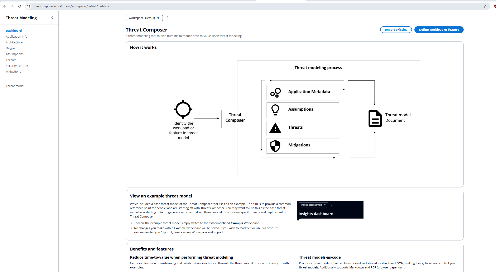
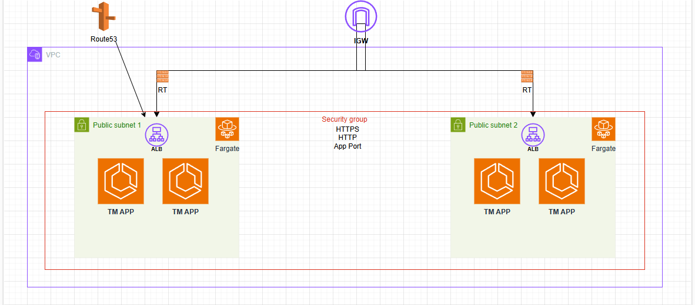

# Threat Composer App Deployment 🚀 

This is a project i took on to automate the deployment of the AWS Threat Composer application by containerising the app, orchestrating its deployment to AWS Elastic Container Service (ECS), and managing infrastructure with Terraform. The entire workflow is seamlessly executed through GitHub Actions, ensuring a continuous and reliable deployment pipeline.

## The tool itself (AWS Threat Composer)

## Project Overview

The Threat Composer Deployment project is designed to simplify and streamline the deployment process of the AWS Threat Composer application by using the following features/practices:

**Containerisation:** The application is containerised using Docker, making it easily portable and consistent across different deployment environments.

**ECS Deployment:** By deploying the containerised app to Amazon ECS, the project leverages the scalability, security, and ease of management of AWS’s managed container service.

**Terrform - infrastructure as Code (IaC):** I used Terraform to define, provision, and manage all necessary cloud resources, such as ECS clusters, networking, and IAM policies.

**GitHub Actions CI/CD Pipeline:** I used GitHub Actions workflows automate the entire process, from building and pushing the Docker image to deploying it on ECS, ensuring reliable and repeatable deployments.

## Deployment Infrastructure

